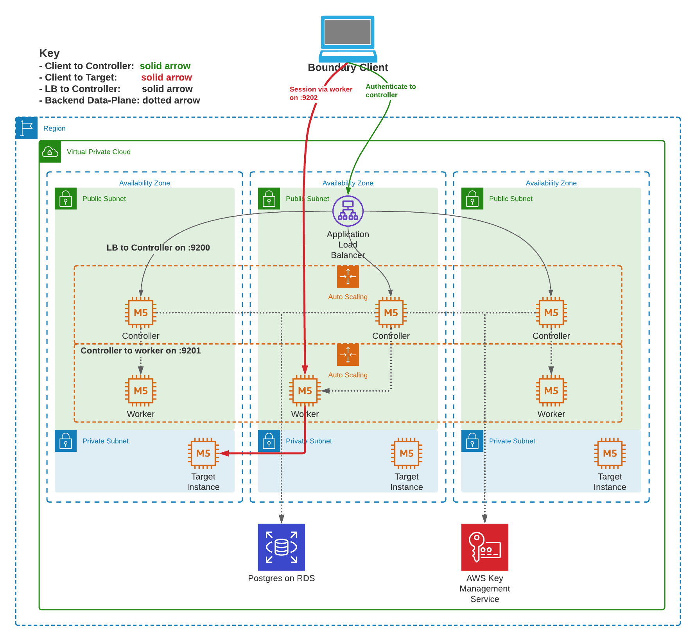

# Boundary Deployment Examples
This directory contains two deployment examples for Boundary using Terraform. The `aws/` directory contains an example AWS reference architecture codified in Terraform. The `boundary/` directory contains an example Terraform configuration for Boundary using the [Boundary Terraform Provider](https://github.com/hashicorp/terraform-provider-boundary).

## Reference


## Requirements
- Terraform 0.13
- Go 1.15 or later 

## Deploy
To deploy this example:
- Configure aws credentials `AWS_PROFILE=<profile>`
- Make sure you have a local checkout of `github.com/hashicorp/boundary`
- Build the `boundary` binary for linux using `XC_OSARCH=linux/amd64 make dev` or download from our [release page](https://boundaryproject.io/) on our docs site.
- In the `example` directory, run 

```
terraform apply -target module.aws -var boundary_bin=<path to your binary>
```

If your public SSH key you want to SSH to these hosts are not located at `~/.ssh/id_rsa.pub` then you'll also need to override that value:
```
terraform apply -target module.aws -var boundary_bin=<path to your binary> -var pub_ssh_key_path=<path to your SSH public key>
```

If the private key is not named the same as the public key but without the .pub suffix and/or is not stored in the same directory, you can use the `priv_ssh_key_path` variable also to point to its location; otherwise its filename will be inferred from the filename of the public key.

## Verify
- Once your AWS infra is live, you can SSH to your workers and controllers and see their configuration:
  - `ssh ubuntu@<controller-ip>`
  - `sudo systemctl status boundary-controller`
  - For workers, the systemd unit is called `boundary-worker`
  - The admin console will be available at `https://boundary-test-controller-<random_name>-<random_sha>.elb.us-east-1.amazonaws.com:9200`

## Configure Boundary 
- Configure boundary using `terraform apply` (without the target flag), this will configure boundary per `boundary/main.tf`

## Login
- Open the console in a browser and login to the instance using one of the `backend_users` defined in the main.tf (or, if you saved the output from deploying the aws module, use the output from the init script for the default username/password)
- Have a look at the GUI to understand the structure of organizations, scopes and targets.
- Login on the CLI: 

```
export BOUNDARY_ADDR='https://skeleton-key.nl'
auth_method_id=$(boundary auth-methods list -recursive -format=json | jq '.items[0].id' -r)
export BOUNDARY_TOKEN=$(boundary authenticate password -keyring-type=none   -format=json   -login-name=jim -password foofoofoo -auth-method-id=${auth_method_id} | jq '.item.attributes.token' -r)
```

You can also use this login name in the Boundary console that you navigated to in the verify step.

## Connect

Connect to the target in the private subnet via Boundary:

```
boundary connect ssh --username ubuntu -target-name=backend_servers_ssh -target-scope-name=core_infra -- -i secrets/boundary.rsa
```
